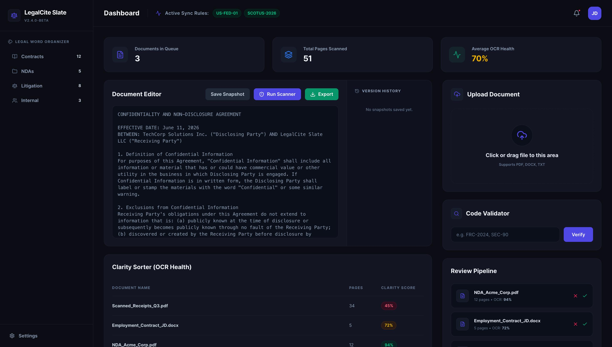
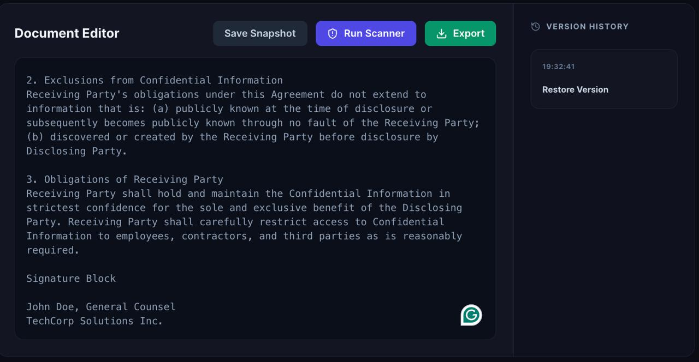
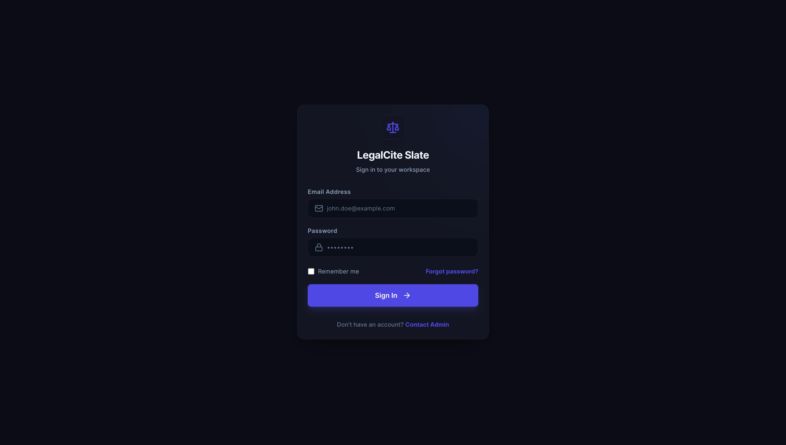

# ⚖️ LegalCite Slate

A premium, dark-themed React dashboard designed for legal professionals to seamlessly organize, OCR-scan, validate, and review legal documents. Built with a focus on modern UI/UX, featuring a custom flat dark aesthetic using Tailwind CSS.

---

## 📸 Screenshots of the UI

### 1. The Dashboard

*(A sleek, flat dark theme dashboard providing an overview of document analytics, OCR health, and review queues.)*

### 2. Document Editor & Code Validator

*(Built-in text editor with a mock OCR scanner and an autocomplete search bar for validating legal codes like FRC-2024.)*

### 3. Login Screen

*(A beautifully styled mock login screen with a cohesive dark aesthetic and glowing accents.)*

---

## ✨ Key Features

- **Document Editor & Scanner**: Built-in text editor that includes a mock OCR scanner to detect unmatched quotes and formatting errors, complete with a version history tracking system.
- **Smart Code Validator**: An autocomplete search bar that validates legal codes (e.g., FRC-2024, SEC-90) and displays recent queries.
- **Document Uploader**: A sleek drag-and-drop file upload zone featuring animated progress bars to simulate OCR document scanning.
- **Clarity Sorter**: A data table that tracks OCR health and clarity scores across your master list of uploaded documents.
- **Review Pipeline**: A dedicated queue for rejecting or approving scanned documents.
- **Premium Dark Mode**: A highly customized, cohesive Tailwind CSS dark theme (`#0A0D14` backgrounds with Indigo/Emerald accents).
- **Authentication Flow**: Includes a beautifully styled mock login screen.

---

## 🚀 Tech Stack

- **Frontend Framework**: React (Vite) for fast, modern component rendering.
- **Styling**: Tailwind CSS (Custom utility classes like `.ui-panel`, `.btn-primary`, `.input-field`).
- **Icons**: Lucide React for beautiful, consistent iconography.
- **State Management**: React Context API (`SyncContext`).

---

## 📦 Getting Started

1. **Clone the repository:**
   ```bash
   git clone https://github.com/krishshinde2128-glitch/LegalCite-Slate.git
   cd LegalCite-Slate
   ```

2. **Install dependencies:**
   ```bash
   npm install
   ```

3. **Run the development server:**
   ```bash
   npm run dev
   ```

4. **View the app:**
   Open your browser and navigate to `http://localhost:5173`. You can bypass the login screen by typing any text into the email and password fields and clicking "Sign In".

---

## 👨‍💻 Author

**Name**: Krish Shinde  
**Batch**: Larry Page  
**Course**: B.Tech CSE  
